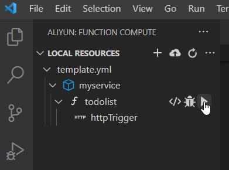

# todolist - Web API written in Node.js and deploy to Alibaba Cloud Function Compute

## Brief of API
Service name: myservice
Function name: todolist

A list is used to store string. The list can be listed, added, removed, dumped data and remove all by various end point. 
1. list - show all content in list
2. add - add a string to the list
3. remove - remove a string found in the list regardless of upper case nor lower case.
4. addall - dump a list to the list without duplication
5. removeall - clear the list

## How to call the API by using postman?
1. Show all content in the list **GET /list**

 

2. Add a string to the list **POST /add** 

3. Remove a string found in the list regardless of upper case nor lower case. **PUT /remove** 

    For example, if the list contains "apple", "APPLE" can be found and removed.  

4. Dump a list to the list without duplication **POST /addall** 

5. Clear the list **POST /removeall** 

## How to execute this API in your computer by Visual Studio Code?

1. Select aliyun in left navigation tab

2. Find function name "todolist". Click the arrow

3. Find the link in terminal and copy it to the postman

